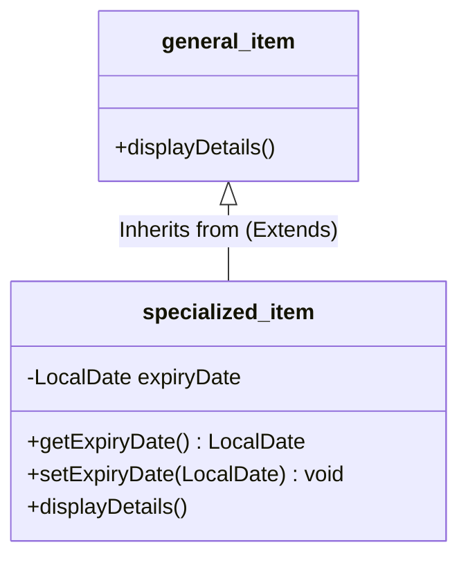

# Inventory

```mermaid
classDiagram
    direction BT
    class general_item {
        +displayDetails()
    }
    class specialized_item {
        -LocalDate expiryDate
        +getExpiryDate() LocalDate
        +setExpiryDate(LocalDate) void
        +displayDetails()
    }
    specialized_item --|> general_item : Inherits from (Extends)
```
